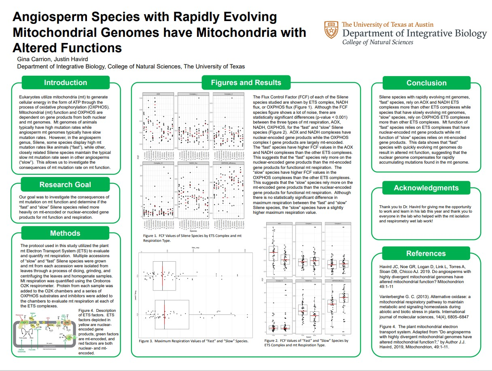
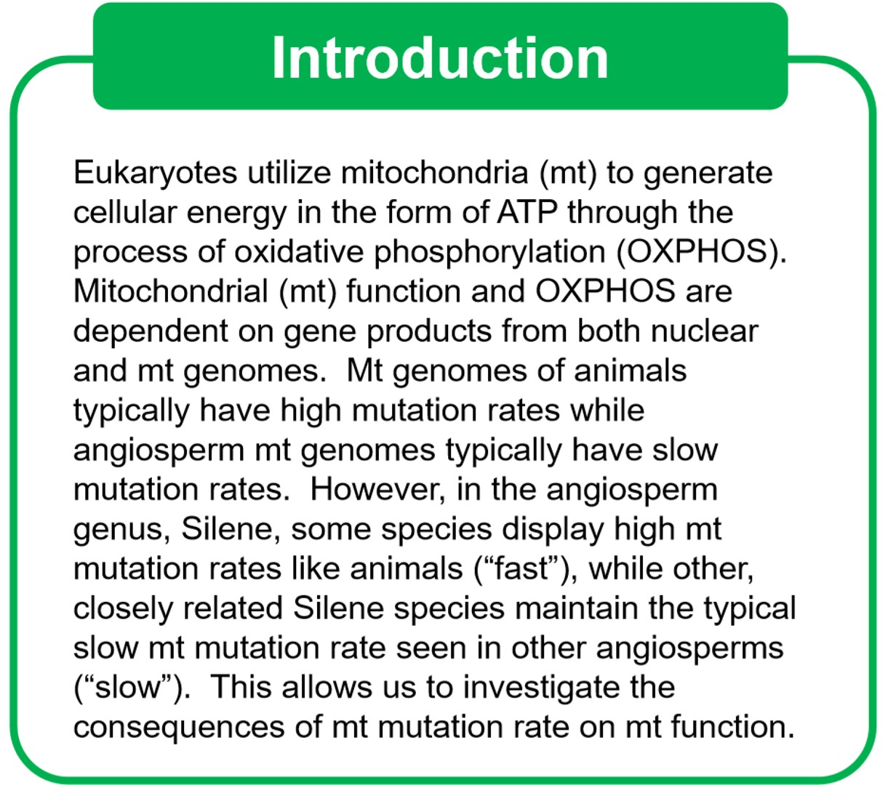
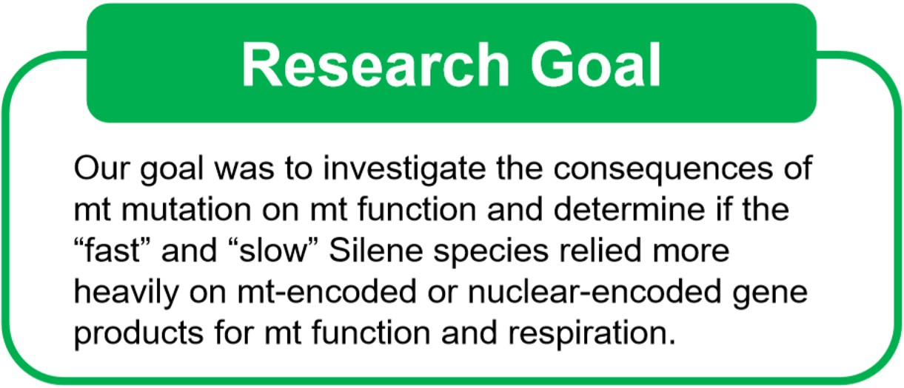
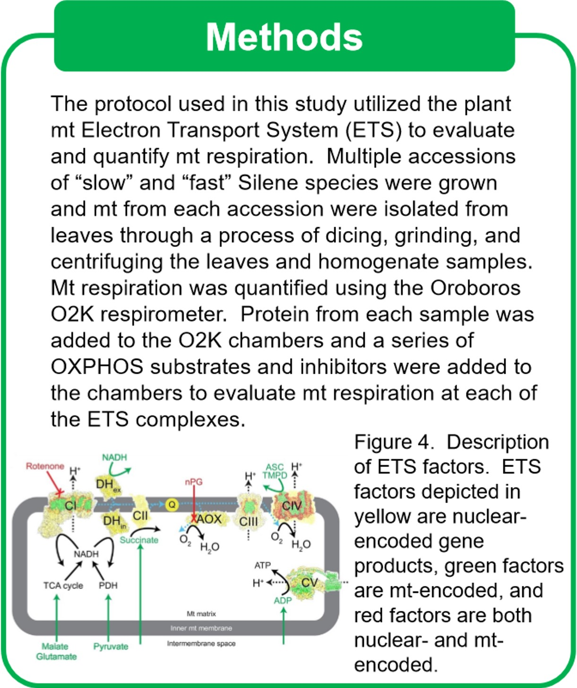
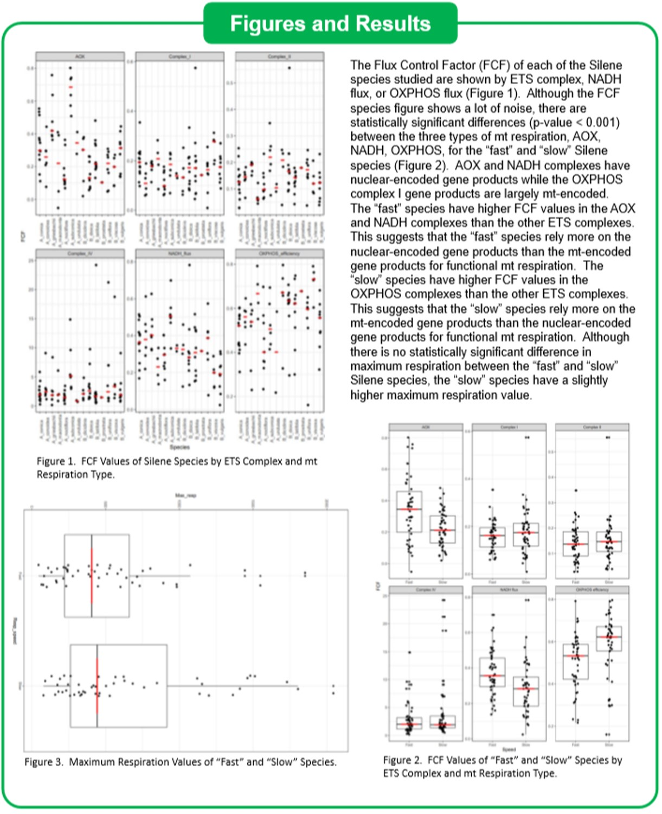
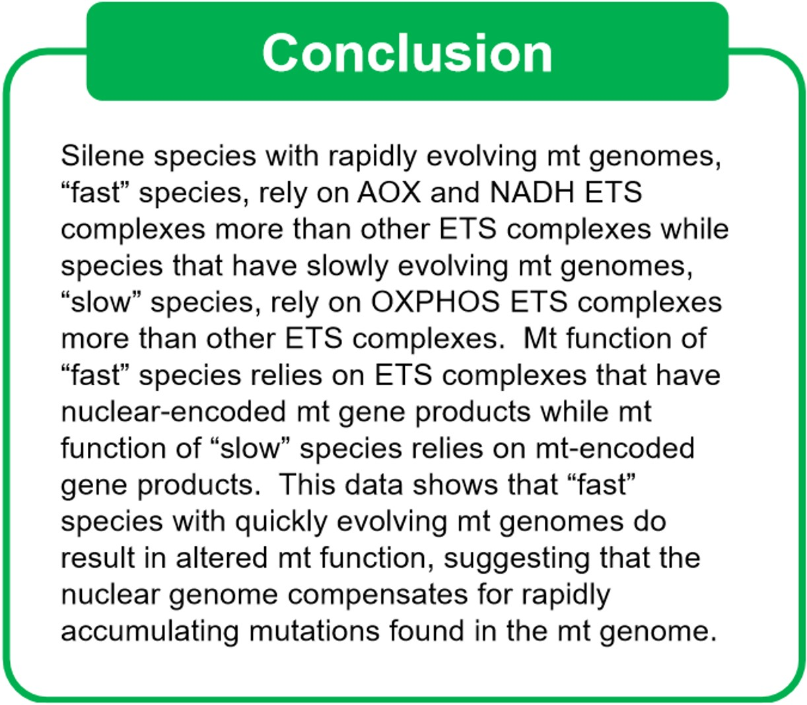
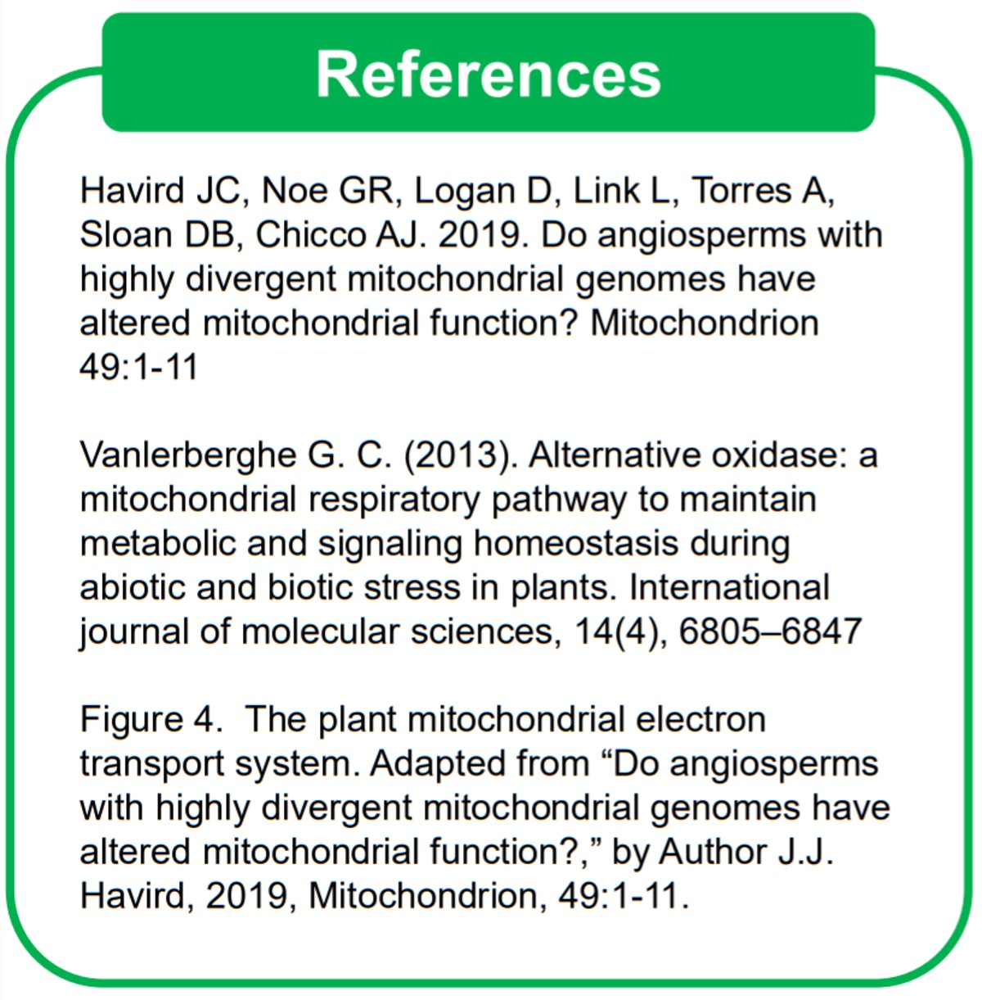

Please see the following publication and associated research poster.

* [High mitochondrial mutation rates in Silene are associated with nuclear-mediated changes in mitochondrial physiology](mitopub.pdf)

