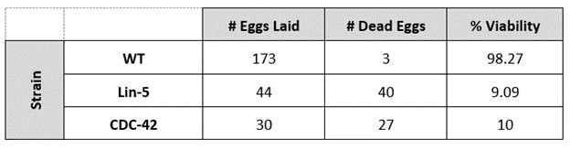
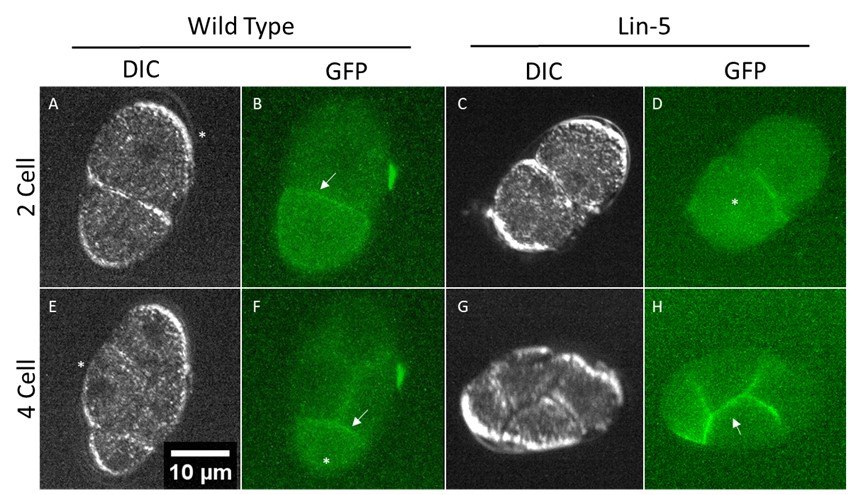
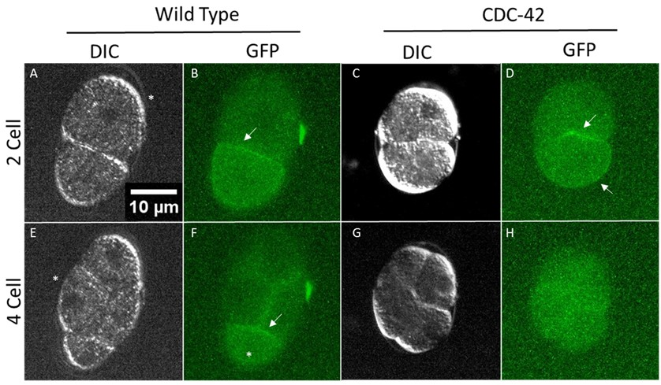

# Introduction

Cell polarity is an important feature of cell development in metazoans.  Molecular cell polarity refers to the asymmetrical distribution of proteins and other cellular components within the cell and contributes to normal cell division.  Polarity, which  is established at the one-cell stage, leads to asymmetrical cell divisions and the differentiation of cell fates (Ramanujam, R., et al, 2018).

Partitioning-defective (PAR)  proteins are a group of highly conserved proteins found in metazoans that regulate cell polarity.  Typically, PAR proteins localize asymmetrically in cells and are either mutually supportive or mutually antagonistic.  Before zygote polarization, anterior PAR proteins are found in the cell cortex while posterior PAR proteins are found in the cytoplasm.  After two distinct phases of zygote polarization, establishment and maintenance, PAR proteins localize to opposite ends of the cell  (Lang, C.F., et al, 2017 ).  

PAR-1 and Atypical Protein Kinase C (aPKC) are mutually antagonistic kinases involved in cell polarization.  After symmetry breaking occurs in the zygote, PAR-1 localizes in the posterior portion of the cell while aPKC localizes in the anterior portion of the cell.  Localization of these kinases’ aids in the asymmetrical division of the zygote into a larger anterior cell and a smaller posterior cell.  The anterior cell ultimately differentiates into the epidermis and neurons, while the posterior cell differentiates into intestines, muscles, and germline cells (Personal communication with Dickinson Lab, UT Austin).  However, not much is known about the genes and molecular mechanisms that control the localization of PAR-1 and aPKC.

Lin-5 and CDC-42 are putative genes involved in defining early cell polarity.  Lin-5 is involved in positioning the mitotic spindle and embryos that lack Lin-5 function fail to properly align their chromosomes and undergo cytokinesis (Lorson, M.A., et al, 2000).  CDC-42 has been shown to associate with PAR-6 and aPKC and recruit this complex to the anterior portion of the cell (Etienne-Manneville, S. et al, 2001).
To determine if the genes, Lin-5 and CDC-42, are involved in defining early cell polarity in *C. Elegans* embryos, we introduced RNAi constructs that knocked down the expression of these genes.  We then observed the shape, orientation, and concentration of PAR-2::GFP in two-cell and four-cell stage *C. Elegans* embryos.  We found that the two-cell and four-cell stage Lin-5 and CDC-42 knockdown embryos divided symmetrically and that PAR-2::GFP was either absent from the cells or concentrated in an atypical location within the cells.

# Methods

### Worms

Two *C. Elegans* strains were used in this study.  The first strain, UTX13, expressed PAR-2::GFP and PAR-6::RFP while another strain, UTX3, expressed only PAR-6::RFP.  Both strains were grown on NGM (Nematode Growth Medium) at 20 °C on culture plates with the *E. coli* strain, OP50.  The UTX13 strain was used for imaging the *C. Elegans* embryos while UTX3 was used in viability studies.

### RNAi	

The HT115 strain of *E. coli* contained a transgenic RNAi “empty vector” control or an RNAi vector that targeted the Lin-5 and CDC-42 genes.  RNAi experiments were performed by feeding HT115 *E. coli* to *C. Elegans* at the L3/L4 stage.  Media culture plates for the RNAi knockdown experiments contained NGM, IPTG which induced expression of RNAi constructs, and Carbenicillin that acted as a selective agent for the HT115 strain of *E. coli*.  *C. Elegans* were allowed to lay eggs on the RNAi plates for 2 hours and the eggs remained on the RNAi plate for 48 hours.

### Imaging

*C. Elegans* embryos were transferred from control, Lin-5, and CDC-42 culture plates and placed onto a 0.1% Poly-L-Lysine coated microscope slide with egg buffer and microbeads then sealed with VaLaP around the coverslip.  Embryos were observed at 25 °C on a Leica inverted microscope.  Images were acquired using MicroManager software.  Images were taken at 40x magnification under DIC, GFP, and RFP channels.

# Results

To determine if CDC-42 and Lin-5 are essential genes for *C. Elegans* embryo viability, we performed a viability study for each gene using an RNAi construct.  We transferred L3 and L4 stage *C. Elegans* onto a culture plate with HT115 *E. coli*.  *C. Elegans* were allowed to lay eggs on culture plates for 2 hours then were removed from the plate.  The number of eggs on each plate was counted immediately after the adult *C. Elegans* were removed from the plate, then counted again after 48 hours.  Eggs that were no longer on the plate after 48 hours were presumed to have hatched and the eggs that remained were not viable.  The ratio of dead eggs to hatched eggs was used to determine the percent viability of the Lin-5 and CDC-42 knockdown embryos.  We found that 98.27% of wild type, 9.09% of Lin-5, and 10% of CDC-42 embryos were viable (Table 1).  This result indicates that Lin-5 and CDC-42 are likely essential genes for *C. Elegans* viability, and that the RNAi did not completely knockdown each gene, allowing for some variability between embryos and a small percentage remained viable.  

**Table 1.  Viability Study of *C. Elegans* embryos on empty vector control, Lin-5, and CDC-42 RNAi plates.**   Empty vector wild type control embryos had a percent viability of 98.27%.  Lin-5 knockdown embryos had a percent viability of 9.09%.  CDC-42 embryos had a percent viability of 10%. 

Empty RNAi vector wild type embryos were used as a control.  We observed that wild type two-cell stage embryos divided asymmetrically into one larger cell and one smaller cell (Fig. 1A).  We also observed PAR-2::GFP around the borders and in the cytoplasm of the smaller cell (Fig. 1B).  In the four-cell stage wild type embryo, we saw that the embryo was oriented in a diamond shape and the cells were of unequal sizes (Fig. 1E).  We observed the presence of PAR-2::GFP along the internal borders of the embryo and in the cytoplasm of the smallest cell in the four-cell stage embryo (Fig. 1F).

To test if Lin-5 is involved in defining cell polarity in *C. Elegans*, we introduced an RNAi construct that disrupted Lin-5 expression in *C. Elegans*.  We found that the two-cell stage zygote divided into two equally sized cells (Fig. 1C).  Although there was some PAR-2::GFP present in one of the cells of the two-cell stage embryo, we saw a less dense concentration of PAR-2::GFP along the border and in the cytoplasm of that cell compared to the concentration observed in the wild type (Fig. 1D).  We observed that the four-cell stage Lin-5 embryo was oriented in an oval shape and had cells of equal size, rather than the diamond-shaped, unequally sized cells of the wild type (Fig. 1G).  PAR-2::GFP was observed along the internal cell borders of the four-cell stage embryo and there was no PAR-2::GFP concentration observed in the cytoplasm (Fig. 1H).  The symmetrical division and difference in the distribution of PAR-2::GFP in the Lin-5 knockdown embryo indicates a loss of cell polarity.  

**Figure 1. Wild Type and Lin-5 Knockdown Embryos at 2-cell and 4-cell stages.**  Wild type embryos are positioned anterior towards the bottom.   (A-D) 2-cell stage embryos.  (E-H) 4-cell stage embryos. (A) DIC image of a wild type embryo that has divided asymmetrically into a larger cell ( * ) and a smaller cell.  (B) GFP image of a wild type embryo that has divided asymmetrically and shows PAR-2::GFP density along the border and cytoplasm of the smaller cell (arrow).  (C)  DIC image of a Lin-5 knockdown embryo that has divided symmetrically into two evenly sized cells.  (D)  GFP image of a Lin-5 knockdown embryo that shows PAR-2::GFP density in the cytoplasm of one of the cells ( * ).  (E)  DIC image of a wild type embryo that has divided asymmetrically into two larger cells ( * ) and two smaller cells and is oriented in a diamond shape.  (F)  GFP image of a wild type embryo that has PAR-2::GFP density along the internal borders of the cells (arrow) and PAR-2::GFP concentration in one of the smaller cells ( * ).  (G)  DIC image of a Lin-5 knockdown embryo that has divided symmetrically into four evenly sized cells and is oriented in an oval shape.  (H)  GFP image of a Lin-5 knockdown embryo that has PAR-2::GFP concentration along the internal borders of the cell (arrow).  Scale Bar = 10 μm
  
  

To establish if CDC-42 contributes to defining cell polarity in *C. Elegans*, we introduced an RNAi construct that disrupted CDC-42 expression in *C. Elegans*.  In the two-cell stage CDC-42 knockdown embryo, we observed a symmetrical division in the two-cell stage CDC-42 knockdown embryo (Fig. 2C).  Additionally, we found some PAR-2::GFP expression around the border of one cell and no PAR-2::GFP expression around the border and in the cytoplasm of the other cell (Fig. 2D).  We saw that the four-cell stage CDC-42 knockdown embryo divided into cells of equal size and was oriented in a circular shape, rather than the unequally sized cells and diamond orientation of the wild type (Fig. 2G).  Furthermore, we did not observe any PAR-2::GFP expression in this embryo (Fig. 2H).  These results indicate that there was a loss of cell polarity in the CDC-42 knockdown embryos. 

**Figure 2. Wild Type and CDC-42 Knockdown Embryos at 2-cell and 4-cell stages.** Wild type embryos are positioned anterior towards the bottom.   (A-D) 2-cell stage embryos.  (E-H) 4-cell stage embryos. (A) DIC image of a wild type embryo that has divided asymmetrically into a larger cell ( * ) and a smaller cell.  (B) GFP image of a wild type embryo that has divided asymmetrically and shows PAR-2::GFP density along the border and cytoplasm of the smaller cell (arrow).  (C)  DIC image of a CDC-42 knockdown embryo that has divided symmetrically into two evenly sized cells.  (D)  GFP image of a CDC-42 knockdown embryo that shows PAR-2::GFP density around the border of one of the cells (arrow).  (E)  DIC image of a wild type embryo that has divided asymmetrically into two larger cells ( * ) and two smaller cells and is oriented in a diamond shape.  (F)  GFP image of a wild type embryo that has PAR-2::GFP density along the internal borders of the cells (arrow) and PAR-2::GFP concentration in one of the smaller cells ( * ).  (G)  DIC image of a CDC-42 knockdown embryo that has divided symmetrically into four evenly sized cells and is oriented in a circular shape.  (H)  GFP image of a CDC-42 knockdown embryo that has no PAR-2::GFP expression.  Scale Bar = 10 μm

# Discussion

In this study, we have shown that the genes, Lin-5 and CDC-42, are involved in establishing cell polarity in the zygote of *C. Elegans*.  We found that Lin-5 knockdown embryos displayed symmetric divisions and altered distributions of PAR-2::GFP (Fig. 1).  We also found that CDC-42 knockdown embryos displayed symmetric divisions and had PAR-2::GFP distributed along the border of one of the cells in the two-cell stage, but completely lacked PAR-2::GFP in the four-cell stage embryo (Fig. 2).  After conducting a viability study, our data showed that *C. Elegans* embryos that were introduced to a Lin-5 RNAi construct had a viability rate of 9.09% while embryos that were introduced to a CDC-42 RNAi construct had a viability rate of 10.0% (Table 1).  While the empty vector wild type control embryos had a viability rate of 98.27%, the Lin-5 and CDC-42 knockdown embryos had viability rates of 9.09% and 10%, respectively.  These results indicate that the Lin-5 and CDC-42 genes are essential for viability.  It is likely that the RNAi constructs were not completely penetrative and did not entirely knock out each target gene.  Incomplete penetrance could have led to variable phenotypes in the embryos and allowed for some knockdown embryos to have remained viable.

Previous literature has shown that Lin-5 is involved in the spindle  apparatus needed for chromosome segregation and cytokinesis (Lorson, M.A., et al, 2000).  Other researchers have found that Lin-5 is necessary for mitotic spindle organization and positioning, a requirement for asymmetric divisions and differential segregation (Liro, M.J, et al, 2016).  The Lin-5 knockdown likely divided symmetrically in the two-cell and four-cell stages because the mitotic spindle was not properly organized or aligned (Fig. 1).  Since concentrated PAR-2::GFP was found in the cell cortexes of the Lin-5 knockdown rather than the cytoplasm in the two-cell and four-cell stages, Lin-5 may play a role in directing the localization of PAR-2.  Another study has shown that Lin-5 appears to act downstream of the PAR proteins (Srinivasan, D. G., et al, 2003).  The distribution of PAR-2::GFP in the Lin-5 knockdown embryos may have localized in a manner more consistent with the wild type distribution of PAR-2::GFP because Lin-5 acts downstream of PAR proteins (Fig. 1).  A limitation in this study may have been that the RNAi construct did not fully knockdown the Lin-5 gene contributing to partial or variable Lin-5 phenotypes observed in the embryos.  

CDC-42 is critical in maintaining cell polarity and asymmetrical cell division (Mizukawa, B., et al, 2017).  Polarization of the Microtubule Organizing Center (MTOC) is directed by CDC-42 through the PAR-6/aPKC pathway (Lee, J.S., et al, 2005).  Loss of the function of CDC-42 could disrupt proper organization of the MTOC, leading to symmetrical division and a loss of polarization as seen in the CDC-42 knockdown embryos (Fig. 2).  Symmetrical cell division and loss of cell polarity are consistent with previous literature.  Although we imaged the embryos under RFP to view the concentration of PAR-6::RFP in the embryos, there was no detectable RFP in any of the embryos.  Although it is possible that the genetic knockdowns caused a loss of PAR-6::RFP, it may be that PAR-6 was not properly or fully labelled with RFP so we were unable to study PAR-6 in the embryos. 

Overall, our results show that Lin-5 and CDC-42 are involved in defining early cell polarity in *C. Elegans* embryos.  Our findings can serve as a guide to further study how Lin-5 and CDC-42 contribute the molecular mechanisms that control asymmetric cell division and cell polarity.  A future study may use a pull-down assay to determine if Lin-5 and PAR-2 associate in the cell and contribute to establishing cell polarity.

# References

Lang, C. F., & Munro, E. (2017). The PAR proteins: from molecular circuits to dynamic self-stabilizing cell polarity. Development (Cambridge, England), 144(19), 3405–3416.

Liro, M. J., & Rose, L. S. (2016). Mitotic Spindle Positioning in the EMS Cell of Caenorhabditis elegans Requires LET-99 and LIN-5/NuMA. Genetics, 204(3), 1177–1189.

Lee, J. S., Chang, M. I., Tseng, Y., & Wirtz, D. (2005). Cdc42 mediates nucleus movement and MTOC polarization in Swiss 3T3 fibroblasts under mechanical shear stress. Molecular biology of the cell, 16(2), 871–880.										

Lorson, M. A., Horvitz, H. R., & van den Heuvel, S. (2000). LIN-5 is a novel component of the spindle apparatus required for chromosome segregation and cleavage plane specification in Caenorhabditis elegans. The Journal of cell biology, 148(1), 73–86.

Mizukawa, B., O'Brien, E., Moreira, D. C., Wunderlich, M., Hochstetler, C. L., Duan, X., Liu, W., Orr, E., Grimes, H. L., Mulloy, J. C., & Zheng, Y. (2017). The cell polarity determinant CDC42 controls division symmetry to block leukemia cell differentiation. Blood, 130(11), 1336–1346.

Ramanujam, R., Han, Z., Zhang, Z. et al. Establishment of the PAR-1 cortical gradient by the aPKC-PRBH circuit. Nat Chem Biol 14, 917–927 (2018).

Srinivasan, D. G., Fisk, R. M., Xu, H., & van den Heuvel, S. (2003). A complex of LIN-5 and GPR proteins regulates G protein signaling and spindle function in C elegans. Genes & development, 17(10), 1225–1239. 

